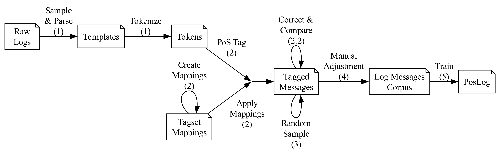

# PosLog: Creating a Part of Speech Tagger for Log Messages

This repo belongs to the work of the same name, in which a corpus of log messages was compiled and annotated in Upos. 
PosLog, a PoS tagger specifically for log messages, was then trained on this corpus.
The sources of PosLog as well as the creation of the corpus is documented in this repo.

# PosLog Usage
PosLog usage you may find here: [`src/README.md`](/src/README.md).


# Reproduce Training Data 

- [PosLog: Creating a PoS Tagger for Log Messages](#poslog-creating-a-pos-tagger-for-log-messages)
- [PosLog Usage](#poslog-usage)
- [Reproduce Training Data](#reproduce-training-data)
  - [Install Requirements in Virtual Environment](#install-requirements-in-virtual-environment)
  - [Developing PosLog](#developing-poslog)
  - [Troubleshooting](#troubleshooting)
  - [Data Processing](#data-processing)
  - [1. Selection of Data](#1-selection-of-data)
  - [2. PoS Tagging and Tagset Mapping](#2-pos-tagging-and-tagset-mapping)
    - [PoS-Tagsets](#pos-tagsets)
    - [PoS Tagger](#pos-tagger)
    - [Tagset Mappings](#tagset-mappings)
    - [Resulted Mappings](#resulted-mappings)
  - [2.2. Tag Correction \& Comparison](#22-tag-correction--comparison)
  - [3. Random Sample](#3-random-sample)
  - [4. Manual Adjustment](#4-manual-adjustment)
  - [5. Training PosLog](#5-training-poslog)
- [Citation](#citation)
- [References](#references)

## Install Requirements in Virtual Environment
1. Create virtual environment
```
python3 -m venv .venv
```
2. Activate virtual environment
```
source .venv/bin/activate
```
3. Install requirements
```
pip install -r requirements.txt
```

If you want to use this kernel in Jupyter Notebook, you need to install the kernel as well:
```bash
python -m ipykernel install --user --name=poslog
```

## Developing PosLog

For development purposes, you can install the package in editable mode. 
(Otherwise it will be installed by `pip` from the `requirements.txt`)
```bash
pip install -e src/
```

Having trouble this way, you may try to install the package without symlinks:
```bash
pip install src/
```

## Troubleshooting
- TreeTagger and `SafeConfigParser`:
    For python 3.11 you'll need to change the line in `.venv/lib/python3.11/site-packages/treetaggerwrapper.py` from   
    `g_config = configparser.SafeConfigParser()` to   
    `g_config = configparser.ConfigParser()` (currently it’s line 544).


## Data Processing
The following five notebooks guide you through the preparation of the corpus. 
The numbering correlates with the following sections:

- `1_templates_collect_numb_var.ipynb`  
    Collect 10.000 random lines from each of the 16 datasets and extract templates.
    Resulting in 5,548 unique templates.  
    **Output:** `/out/poslog/1_examples_10000_each_seed-42_numb_var.csv`  
    **Columns:** `Dataset, Line, Example, Template, ClusterId`
- `2_pos_tagging_create.ipynb`  
    Tokenizing and PoS tagging of the templates with the five taggers (incl. tagset mapping).  
    **Output:** `/out/poslog/2_examples_tagged_upos.csv`  
    **Added Columns:** `Tokens, nltk, stanza, spacy, hanta, treetagger`
- `2-2_tag_comparison_correction.ipynb`
    Automated tag correction and comparison of the five taggers (majority voting).  
    **Output:** `/out/poslog/2-2_examples_tagged_upos_majority.csv`  
    **Added Columns:** `TagComparison, Majority`
    Dataset,Line,Example,Template,ClusterId,Tokens,nltk,stanza,spacy,hanta,treetagger,TagComparison,Majority
- `3_random_sample.ipynb`  
    Minimal UI for tag correction of a random sample of 100 log messages (824 tokens).  
    Note: The random sample is not used in the final training data, but only for the evaluation of the automated tagging.  
    **WIP File:** `/out/poslog/3_random_sample_wip_upos.csv`  
    **Added Columns:** `ManualTagging`
- `4_pos_tagging_manual_adjustment.ipynb`  
    UI for manual tagging minority tokens.
    **Output:** `/out/poslog/4_ground_truth_wip_upos.csv`  This is the final file for the training data.  
    **Added Columns:** `ManualTagging`
- `5_poslog_crf.ipynb`  
    Training of PosLog with the training data (80% of shuffled column `ManualTagging` from `/out/poslog/4_ground_truth_wip_upos.csv`).
    Evaluate PosLog and compare it with the other taggers on test data (20%).  
    **Output:** `/src/poslog/models/pos_log_upos_crf_10k_model.pkl`  
    

  
*Figure: Overview of the data processing pipeline.*

## 1. Selection of Data

As stated in [`data/README.md`](/data/README.md) you can download the datasets from [Loghub](https://github.com/logpai/loghub).


We use the 16 datasets from Loghub (Zhu et al. 2023) as training and
evaluation data. They represent a wide range of software systems, such
as distributed systems, supercomputers, operating systems, mobile
systems, server applications, and standalone software and are therefore
suitable for a generic classifier. The complete dataset contains over
400 million lines of logs.

To evaluate PosLog , we sample 10,000 random lines from
each of the 16 datasets resulting in 160,000 total log messages. A fixed
seed was used for the random selection to ensure reproducibility.

We use NumbVar as a log parser to extract log
templates from our data selection. Templates help us to remove duplicate
messages and also reveal the building blocks of the data, which avoids
over-representing logs that appear frequently. This allowed us to reduce
160,000 log messages to 5,548 unique templates, which we use in the next
steps. Since the variable parts of templates (parameters) can include
numbers, addresses, or names, we select one example line (an instance)
for each template. In this way, we can even determine the PoS tags of
the parameters.


## 2. PoS Tagging and Tagset Mapping

Since PosLog was trained on a corpus we tokenized a specific way, we
included the tokenizer `PosLogTokenizer` in this package.
On our data selection, the 5,548 log templates result in 64,542 tokens
($\mu = 11.6$ and $\sigma = 11.3$).

### PoS-Tagsets

Below we work with the following three frequently used PoS tagsets.

 -  [Upos (Universal PoS-Tags)](https://universaldependencies.org/u/pos/) is a language-agnostic tagset with 17 tags. 
    This tagset was formed by Google with 12 tags (Petrov, Das, and McDonald 2012), 
    and was later expanded to 17 tags by Universal Dependencies (Nivre et al. 2016).

 -  The [PTB (Penn Treebank PoS-Tags)](https://www.ling.upenn.edu/courses/Fall_2003/ling001/penn_treebank_pos.html) 
    is a more granular tagset with 36 tags for the English language, developed at the University of Pennsylvania (Marcus, Marcinkiewicz, and Santorini 1993).

 -  The [Brown tagset](http://clu.uni.no/icame/manuals/BROWN/INDEX.HTM#bc6) contains 86 tags (plus merged tags, e.g. `WRB+DOD`), making it one of the most detailed tagsets. 
 It originated from the Brown Corpus project at Brown University (Francis and Kučera 1964).

### PoS Tagger

The following five PoS taggers are used, utilizing different tagsets and
extensions.

- *NLTK* (Natural Language Toolkit) has its origin in the University of Pennsylvania as an educational toolkit for NLP in Python.
Its PoS tagger is an averaged perceptron tagger tagging into a superset of PTB of 45 tags (Bird, Klein, and Loper 2009).

- *Stanza* (formerly Stanford NLP) was developed by Stanford University.
It uses neural networks for PoS tagging in PTB and Upos (Qi et al. 2020).

- *SpaCy* was developed by Explosion AI. 
It uses convolutional neural networks for PoS tagging in PTB and Upos (Honnibal et al. 2020).

- *HanTa* (Hanover Tagger) was developed at the Hochschule Hannover. 
Using a Hidden Markov Model it tags in a superset of Brown with 91 tags (Wartena 2023).

- *TreeTagger* was created at the University of Stuttgart. 
It uses decision trees to assign PoS tags in a superset of PTB of 64 tags (Schmid 1994).


### Tagset Mappings

These taggers support different tagsets. 
We want to unify these in Upos. 
We choose Upos because it is designed to be cross-language and therefore it is widely used in NLP applications.
Furthermore, it is the smallest tagset which reduces complexity.

There are already tagset mappings from NLTK to Upos, but only for the initial 12 tags (cf. Petrov, Das, and McDonald 2012). 
The following list shows tags not covered by NLTK with a selection of examples from log messages:
-   `AUX`: Auxiliary verbs (e.g. is, would, must, can, cannot),
-   `INTJ`: Interjections (e.g. Yes, OK, Bye),
-   `PROPN`: Proper Nouns (e.g. Names of variables or machines, pathes or IP addresses),
-   `SCONJ`: Subordinating Conjunction (e.g. that, as, after, before,
    while),
-   `SYM`: Symbols that are no punctuation ($, #, %, &, *, +, <, =, >, @).

Proper nouns would be generalized to nouns and symbols to punctuations
according to the 12 tags mapping. As can be guessed from these examples,
these both are strongly represented in log messages and should have
their own classes. Furthermore, symbols do not always fulfill the same
function in a sentence as punctuation. For these reasons, we have
decided to create the mapping to Upos ourselves.


The following quantity relationship is usually, but not always, true:

Upos $\subseteq$ PTB $\subseteq$ Brown

In most cases we can merge more granular classes from the right to more general classes on the left.
There are three exception:

-   In Brown there is no equivalent to Upos' symbols `SYM`
    (this also applies for PTB's `SYM`, `$` and `#`),

-   In Brown there is no equivalent to PTB's list markers `LS` and

-   PTB summarizes classes prepositions and subordinating conjunctions into one class `IN`, 
    while for Upos and Brown these are two classes each.

In addition, the relation above specifies that it is not possible to map from Upos to PTB or Brown. 

### Resulted Mappings

As a result there are the following five mappings in [`util/pos/mappings`](util/pos/mappings):
-   `ptb_upos.map`: Mapping PTB to Upos with 17 tags,

-   `brown_ptb.map`: Mapping Brown to PTB without merged tags (Since we already had the mappings table, we also support this mapping, even if it is not necessary for this work.),

-   `brown_upos.map`: Mapping Brown to Upos with 17 tags.  
    Note: This mapping is not equivalent to the sequential use of `brown_ptb` and `ptb_upos`.
    The differnces are made by auxiliary verbs (`BE`, `DO`, `HV` and all deviations), which must become auxiliary verbs (`AUX`) in Upos, but are simplified to verbs (`VB`) in PTB. 
    For example `brown_ptb` maps `BE` to `VB`, while `brown_upos` maps `BE` to `AUX`,

-   `tt-ptb_ptb.map`: Mapping TreeTagger's superset of PTB to PTB with 36 tags,

-   `tt-ptb_upos.map`: Mapping TreeTagger's superset of PTB directly to Upos (with the same argumentation of necessity as `brown_upos`).

For interoperability reasons, the mapping files are structured exactly as `nltk` uses them for the tagset mapping in `nltk.tag.mapping.tagset_mapping`.

The xlsx file on which we created the mappings you'll find in [`util/pos/tagset_mapping.xlsx`](util/pos/tagset_mapping.xlsx).


## 2.2. Tag Correction & Comparison

*Independent* of the tagger's result, individual tags are now corrected.
This only affects *unknown* words. Therefore each token is tested
against the following lists: `wordnet`, `words`, `stopwords` from NLTK's corpora and
domain words since these are large lists of common words. We collected
domain words ourselves while working on the datasets. They include 110
recognized words from the computing domain that are not covered by the
lists just mentioned (e.g. keychain, admin, config, Bluetooth, etc.). If
a token is not in any of these lists (things that are in log messages
only), the following corrections are made:

-   If the token is a floating point number, set the tag to number `NUM`
    (e.g. `2.5` or `1e-5`).

-   Punctuation characters only are set to `PUNCT` and symbols to `SYM`.

-   Matching regular expressions for version number (e.g. `v2.0b`),
    identifier like mac addresses, dates and times are also set to
    `NUM`.

-   Variable names as combination of letters and digits in camel, snake
    or kebab case as well as path names and URLs are set to `PROPN` as
    they are identifiers of a specific instance.

-   Key-value pairs are an expression of assignment or state, but are
    not part of a sentence. So we decided to set their tags to `X`.
    (This will be taken into account in the evaluation.)

*Depending* on the result of the tagger, a tag comparison is now made
for all predictions of each token. The mapping problems are taken into account here. 
The following rules for unifying different tags apply if the result set
contains only two different elements:

-   Because PTB and
    Brown only contain modal auxiliary verbs (`MD`) but no auxiliary
    verbs (`AUX`) like Upos: {`AUX`, `VERB`} $\Rightarrow$
    {`AUX`}

-   Because PTB has
    no exclusive class for subordinating conjunction and is mapped to
    `ADP`: {`SCONJ`, `ADP`} $\Rightarrow$ {`SCONJ`}

-   Resolve inconsistency with numbers and symbols (we have already
    safely replaced numbers tags): {`SYM`, `NUM`} $\Rightarrow$ {`SYM`}

The next step is the majority voting. As we have 5 taggers, we choose
the 80 % majority as truth. For the above mentioned unknown words, we
choose the absolute majority since this is any log-specific token not
matching any corrections yet (e.g. `msra-sa-41/10.190.173.170:9000`).

Using this automated voting process, we find a majority vote for 96 % of the tokens and are able to fully tag 68 % of the log messages (i.e., a majority was found for each token in each message). 


## 3. Random Sample

Now that the automated tagging is complete, we validate it with a random
sample. 
Again, we use a random subset of the fully tagged log messages (i.e. a
majority was found for each token in each message). 
This subset contains 100 log messages consisting of 875 tokens. 
We reviewed these 100 messages manually and corrected wrongly tagged tokens. 
The result can be found in the following table. 
Errors occurred in a total of 26 tokens during the automated tag correction. There are 15 errors confusing
`NOUN` with `PROPN`. However, since `NOUN` is the superclass of `PROPN`,
we can consider these to be less severe. (In the original
Upos with 12 tags,
only the class `NOUN` exists for these two). In total, the automated
truth finding is 96.4 % correct, increasing to 98.5 % when excluding
less severe cases.

**Table: Errors in sample of the automated truth finding.**  
*For example, tag `NOUN` was corrected to `PROPN` 8 times in 875 tokens, which corresponds to 0.9%.*

| Wrong Tag | Corrected Tag  | Abs. Occurrence| Rel. Occurrence    | Group Total  |
|-----------|----------------|----------------|--------------------|--------------|
| `PROPN`   | `NOUN`         | 8              | 0.9%               |              |
| `NOUN`    | `PROPN`        | 7              | 0.8%               | ∑=1.7%       |
||
| `VERB`    | `ADJ`          | 3              | 0.3%               |              |
| `PROPN`   | `X`            | 2              | 0.2%               |              |
| `NOUN`    | `VERB`         | 2              | 0.2%               |              |
| `NOUN`    | `PRON`         | 1              | 0.1%               |              |
| `PROPN`   | `ADJ`          | 1              | 0.1%               |              |
| `VERB`    | `NOUN`         | 1              | 0.1%               |              |
| `ADJ`     | `PROPN`        | 1              | 0.1%               | ∑=1.3%       |
||


## 4. Manual Adjustment

Out of the 5,548 log messages 3,759 have been tagged completely automatically.
Now that the automated process was done, we manually tagged another 241 messages (containing 329 minority tokens), bringing us to 4,000 fully tagged messages (40,205 tokens).
These messages are particularly important, as they go beyond the combined knowledge of the taggers. Through manual tagging, we bring the specialized understanding of log messages to the corpus. 

## 5. Training PosLog

Since we decided to tag key-value pairs as `X` during tag correction, we omitted these tokens from the accuracy count in the evaluation of the other taggers after the tagging process 
(this resulted in better accuracies for the other taggers).
PosLog, on the other hand, knows this rule and `X` is also taken into account when calculating the accuracy.
The results can be found in the following table ordered by increasing accuracy.


**Table: Accuracy of PoS tagger in comparison.**  
*The time is shown in seconds per 1 million tokens.
For time measurement, we concatenated the test data set with itself 10 times so that the initial phase of each taggers has less influence on the runtime.*

| Tagger     | Time   | Accuracy   |
|------------|--------|------------|
| **NLTK**   | **25** | 77.90%     |
| HanTa      | 352    | 79.29%     |
| SpaCy      | 425    | 80.14%     |
| TreeTagger | 43     | 80.26%     |
| Stanza     | 5,776  | 88.30%     |
| poslog     | 40     | **96.10%** |


With 90.25%, Stanza achieves significantly higher accuracy than NLTK, HanTa, Spacy and TreeTagger, which reach around 80% accuracy.
PosLog is in the lead with over 8pp more accuracy compared to the best competitor.
Regarding the runtime, there are roughly three classes. 
The fastest are NLTK, TreeTagger and PosLog with between 28 and 45 seconds per 1 million tokens.
HanTa and SpaCy are the second fastest, about 10 times slower.
Stanza is by far the slowest by a factor greater than 100.

See [PosLog Usage](#poslog-usage) for usage examples.

# Citation

Kilian Dangendorf, Sven-Ove Hänsel, Jannik Rosendahl, Felix Heine, Carsten Kleiner, Christian Wartena. 
**PosLog: Creating a PoS Tagger for Log Messages.** *On the importance of being published*, 2025.

# References

- Bird, Steven, Ewan Klein, and Edward Loper. 2009. Natural Language Processing with Python: Analyzing Text with the Natural Language Toolkit. Sebastopol, CA: O'Reilly Media, Inc. https://www.nltk.org/book/.

- Francis, W. Nelson, and Henry Kučera. 1964. Brown Corpus Manual: Manual of Information to Accompany a Standard Corpus of Present-Day Edited American English, for Use with Digital Computers. Revised 1971, Revised and Amplified 1979. Providence, Rhode Island: Department of Linguistics, Brown University. http://clu.uni.no/icame/manuals/BROWN/INDEX.HTM.

- Honnibal, Matthew, Ines Montani, Sofie Van Landeghem, and Adriane Boyd. 2020. "spaCy: Industrial-Strength Natural Language Processing in Python." https://doi.org/10.5281/zenodo.1212303.

- Jiang, Jinzhao, Yuanyuan Fu, and Jian Xu. 2024. "PosParser: A Heuristic Online Log Parsing Method Based on Part-of-Speech Tagging." IEEE Transactions on Big Data, 1--12. https://doi.org/10.1109/TBDATA.2024.3453756.

- Li, Ke, Yuan Xue, Yujie Shao, Bing Su, Yu-an Tan, and Jingjing Hu. 2021. "Software Misconfiguration Troubleshooting Based on State Analysis." In 2021 IEEE Sixth International Conference on Data Science in Cyberspace (DSC), 361--66. https://doi.org/10.1109/DSC53577.2021.00057.

- Li, Zezhou, Jing Zhang, Xianbo Zhang, Feng Lin, Chao Wang, and Xingye Cai. 2022. "Natural Language Processing-Based Model for Log Anomaly Detection." In 2022 IEEE 2nd International Conference on Software Engineering and Artificial Intelligence (SEAI), 129--34. https://doi.org/10.1109/SEAI55746.2022.9832400.

- Lv, Dan, Nurbol Luktarhan, and Yiyong Chen. 2021. "ConAnomaly: Content-Based Anomaly Detection for System Logs." Sensors 21 (18). https://doi.org/10.3390/s21186125.

- Marcus, Mitchell P., Mary Ann Marcinkiewicz, and Beatrice Santorini. 1993. "Building a Large Annotated Corpus of English: The Penn Treebank." Comput. Linguist. 19 (2): 313--30.

- Nivre, Joakim, Marie-Catherine de Marneffe, Filip Ginter, Yoav Goldberg, Jan Hajič, Christopher D. Manning, Ryan McDonald, et al. 2016. "Universal Dependencies V1: A Multilingual Treebank Collection." In Proceedings of the Tenth International Conference on Language Resources and Evaluation (LREC'16), edited by Nicoletta Calzolari, Khalid Choukri, Thierry Declerck, Sara Goggi, Marko Grobelnik, Bente Maegaard, Joseph Mariani, et al., 1659--66. Portorož, Slovenia: European Language Resources Association (ELRA). https://aclanthology.org/L16-1262/.

- Petrov, Slav, Dipanjan Das, and Ryan McDonald. 2012. "A Universal Part-of-Speech Tagset." In Proceedings of the Eighth International Conference on Language Resources and Evaluation (LREC'12), edited by Nicoletta Calzolari, Khalid Choukri, Thierry Declerck, Mehmet Uğur Doğan, Bente Maegaard, Joseph Mariani, Asuncion Moreno, Jan Odijk, and Stelios Piperidis, 2089--96. Istanbul, Turkey: European Language Resources Association (ELRA). https://aclanthology.org/L12-1115/.

- Pi, Aidi, Wei Chen, Will Zeller, and Xiaobo Zhou. 2019. "It Can Understand the Logs, Literally." In 2019 IEEE International Parallel and Distributed Processing Symposium Workshops (IPDPSW), 446--51. https://doi.org/10.1109/IPDPSW.2019.00084.

- Qi, Peng, Yuhao Zhang, Yuhui Zhang, Jason Bolton, and Christopher D. Manning. 2020. "Stanza: A Python Natural Language Processing Toolkit for Many Human Languages." In Proceedings of the 58th Annual Meeting of the Association for Computational Linguistics: System Demonstrations.

- Schmid, Helmut. 1994. "Probabilistic Part-of-Speech Tagging Using Decision Trees." In Proceedings of the International Conference on New Methods in Language Processing. Manchester, UK. https://www.cis.uni-muenchen.de/~schmid/tools/TreeTagger/data/tree-tagger1.pdf.

- Shehu, Yusufu, and Robert Harper. 2022. "Enhancements to Language Modeling Techniques for Adaptable Log Message Classification." IEEE Transactions on Network and Service Management 19 (4): 4662--75. https://doi.org/10.1109/TNSM.2022.3192756.

- Wartena, Christian. 2023. "The Hanover Tagger (Version 1.1.0) - Lemmatization, Morphological Analysis and POS Tagging in Python." Fakultät III - Medien, Information und Design. https://doi.org/10.25968/opus-2457.

- Xu, Wei, Ling Huang, Armando Fox, David Patterson, and Michael I. Jordan. 2009. "Detecting Large-Scale System Problems by Mining Console Logs." In Proceedings of the ACM SIGOPS 22nd Symposium on Operating Systems Principles, 117--32. SOSP '09. New York, NY, USA: Association for Computing Machinery. https://doi.org/10.1145/1629575.1629587.

- Zhang, Tianzhu, Han Qiu, Gabriele Castellano, Myriana Rifai, Chung Shue Chen, and Fabio Pianese. 2023. "System Log Parsing: A Survey." IEEE Transactions on Knowledge and Data Engineering 35 (8): 8596--8614. https://doi.org/10.1109/TKDE.2022.3222417.

- Zhu, Jieming, Shilin He, Pinjia He, Jinyang Liu, and Michael R. Lyu. 2023. "Loghub: A Large Collection of System Log Datasets for AI-Driven Log Analytics." In IEEE International Symposium on Software Reliability Engineering (ISSRE).

- Zhu, Jieming, Shilin He, Jinyang Liu, Pinjia He, Qi Xie, Zibin Zheng, and Michael R. Lyu. 2019. "Tools and Benchmarks for Automated Log Parsing." In Proceedings of the 41st International Conference on Software Engineering: Software Engineering in Practice, 121--30. ICSE-SEIP '19. Montreal, Quebec, Canada: IEEE Press. https://doi.org/10.1109/ICSE-SEIP.2019.00021.
  
This project is open-source and licensed under the terms of the GNU General Public License v3.0. See the [`LICENSE`](LICENSE) file for more details.
